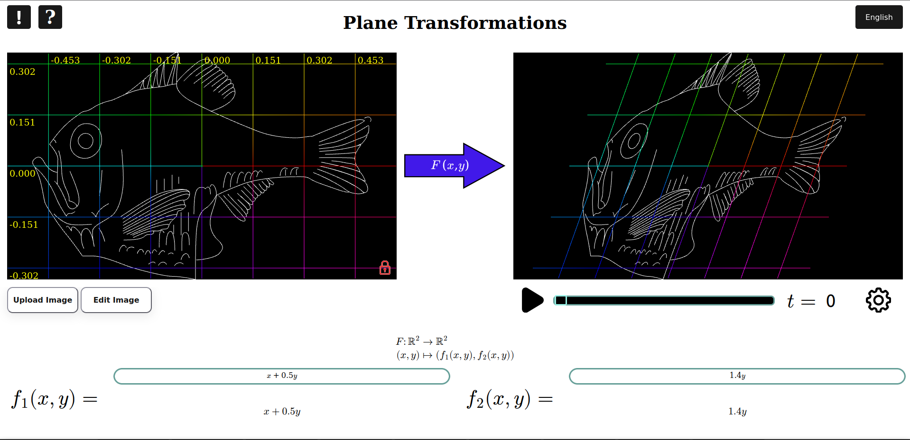

# D'Arcy Playground

By **Jesús Bertani Ramírez**

Welcome to the D'Arcy Playground repository.

The goal of the (page build from this repository)[https://bertani545.github.io/darcy-playground/]) is to let anyone experiment with transformations of the plane ($\mathbb{R}^2 \to \mathbb{R}^2$) and see their effects on the plane, including deforming any image interactively.

As the name sugests, this page is inspired by the work of the biologist **D'Arcy Wentworth Thompson**, who proposed that the changes in plants and animals could be explained through continuous transformations of the Cartesian grid. You can learn more about him on his [Wikipedia page](https://en.wikipedia.org/wiki/D%27Arcy_Wentworth_Thompson\)

This page was created as a *spiritual succesor* to a classic software tool from many years ago, which you can find [here](https://mathshistory.st-andrews.ac.uk/Darcy/darcy/). 

This modern version runs directly in web browsers, making it much easier for anyone to access and explore.

## How to use the page?
You can review these instructions again at any time by hovering over the **?** icon in the interface.

- Load *pre-made examples* by clicking the **!** symbol.
- Upload your own images (`.jpg`, `.png`, `.svg`, etc.) using the upload button or by dragging them onto the **left grid**.
- You can **pan and zoom** the left grid by dragging the mouse or using the scroll wheel. This updates the portion of the plane that the grid covers.
- When the **lock** on the left grid is **red**, the image remains fixed in its position in space.
- Clicking the lock turns it **green**, which keeps the image centered and makes it move and scale together with the grid as you drag or zoom.
- Change the size and position of the **image** by clicking on the *edit* button.
- Next to $f_1$ and $f_2$, input your $R^2 \to R$ functions. Together, they define the transformation shown on the **right grid**, which always resizes to contain all transformed points.
- All regular trigonometric functions are available: $\sin, \cos, \tan, \sec, \csc, \cot$, and their hyperbolic versions. Also available: $\mathbf{asin}, \mathvf{acos}, \mathbf{atan}$.
- Other functions that you can use are $\ln$, $\log_{10}$ (as log), $\exp$, $\Gamma$ (as Gamma), $|\cdot|$ (as abs) and $\sqrt{\cdot}$ (as sqrt).
- Always use parentheses for function arguments.
- The available constants are $e$ and $\pi$ (as pi)
- The available variables are $x$, $y$,  and $t$.
- The variable $t$ adds **time-dependence** to your functions. Use the time controller on the right side of the screen to:
	- Start and pause time,
	- View or edit the current $t$ value,
	- Click on the settings button to ppen the *time settings menu* to define your own time parameters.

